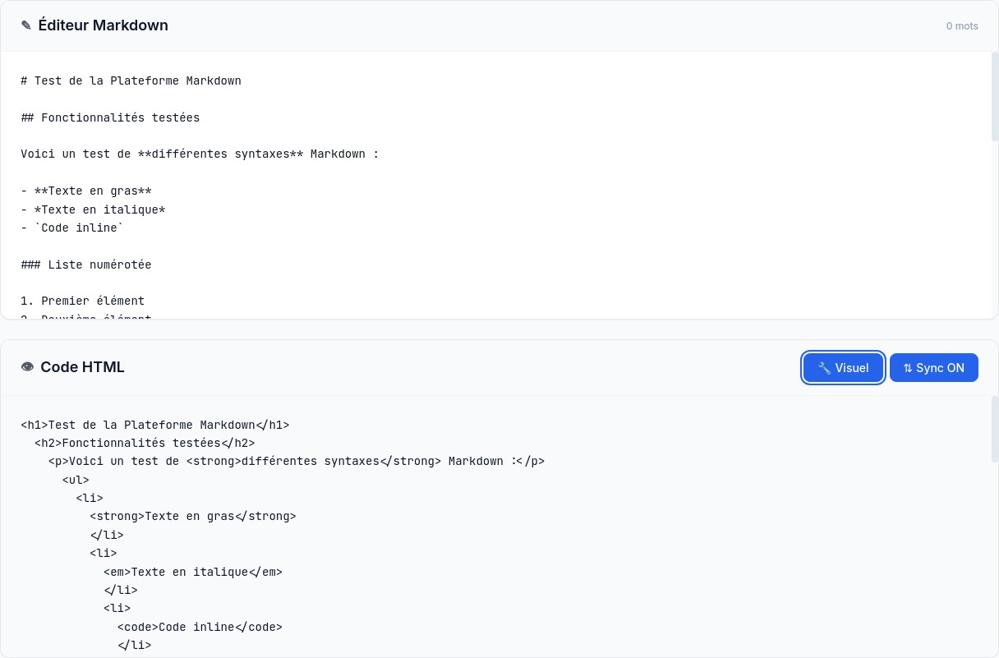
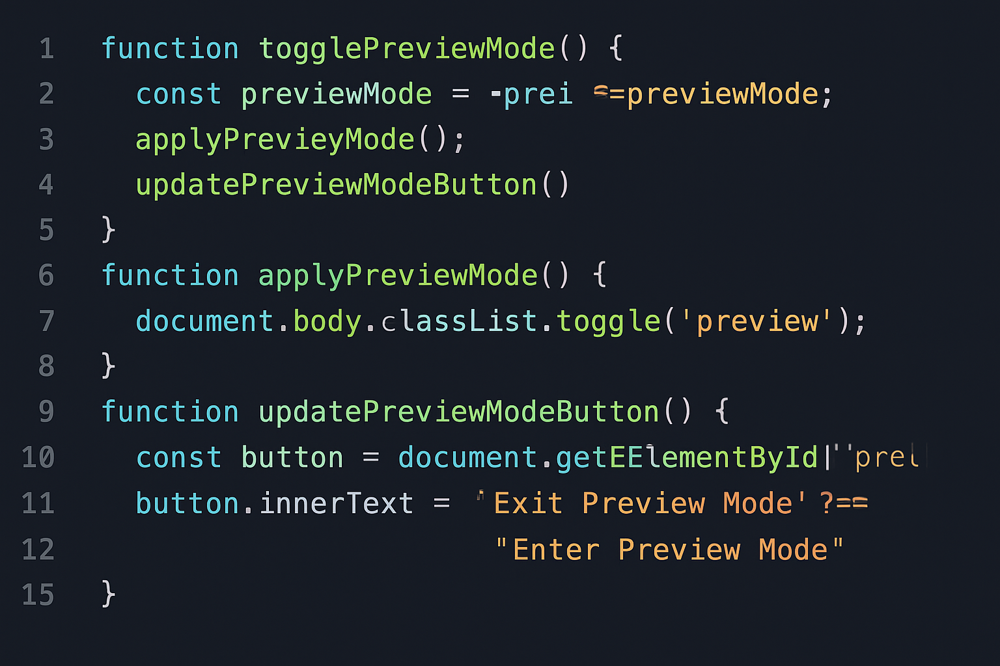
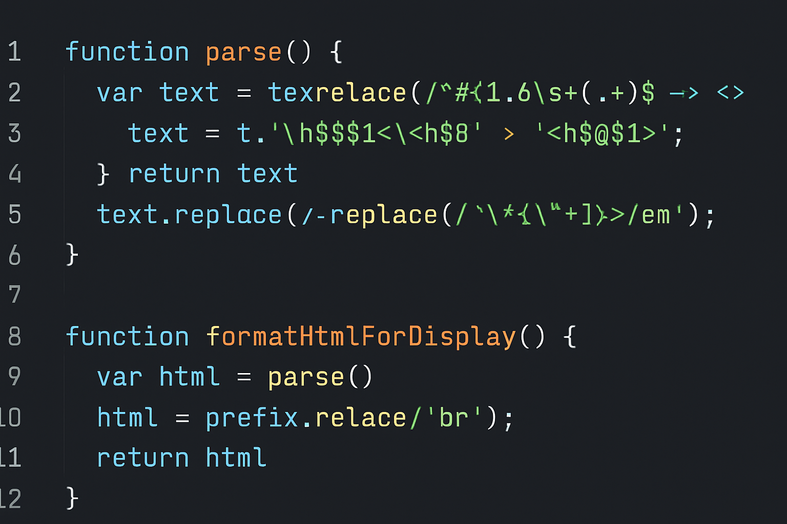

# 📝 Markdown Previewer - Éditeur en temps réel

<div align="center">



**Une plateforme web professionnelle pour prévisualiser le Markdown en temps réel avec affichage HTML brut**

[](https://developer.mozilla.org/en-US/docs/Web/HTML)
[](https://developer.mozilla.org/en-US/docs/Web/CSS)
[](https://developer.mozilla.org/en-US/docs/Web/JavaScript)

[🚀 Démo Live](#installation) • [📖 Documentation](#fonctionnalités) • [💻 Code Source](#architecture-du-code)

</div>

---

## 🎯 Aperçu du Projet

Markdown Previewer est une application web moderne développée par le **Groupe 22** du département Computer Science de **BIT (Burkina Institute of Technology)**. Cette plateforme convertit le Markdown en HTML en temps réel avec la particularité unique de pouvoir **basculer entre l'affichage visuel et le code HTML brut**, permettant aux développeurs de voir exactement le code généré.

### ✨ Fonctionnalités Principales

- **🔄 Conversion temps réel** : Markdown → HTML instantané
- **👁️ Double affichage** : Mode visuel ET code HTML brut
- **📁 Import/Export** : Importez vos fichiers .md et exportez en HTML
- **🎨 Thèmes adaptatifs** : Thème clair et sombre avec basculement
- **📱 Design responsive** : Compatible desktop, tablette et mobile
- **🍔 Menu hamburger** : Navigation mobile optimisée
- **⚡ Performance** : Parseur JavaScript optimisé
- **💾 Sauvegarde auto** : Contenu et préférences sauvés dans le navigateur
- **⌨️ Raccourcis clavier** : Navigation rapide pour les développeurs

---

## 🖼️ Captures d'écran

### Mode Prévisualisation Visuelle

*Interface en mode prévisualisation visuelle avec rendu Markdown*

### Mode Code HTML Brut

*Interface en mode code HTML brut montrant le code généré*

---

## 🚀 Installation et Utilisation

### Méthode 1 : Serveur local simple
```bash
# Clonez le dépôt
git clone https://github.com/NICE-DEV226/markdown-previews.git

# Naviguez vers le dossier
cd markdown-previews

# Démarrez un serveur HTTP simple
python3 -m http.server 8000

# Ouvrez http://localhost:8000 dans votre navigateur
```

### Méthode 2 : Ouverture directe
Ouvrez simplement le fichier `index.html` dans votre navigateur web.

---

## 💻 Architecture du Code

### Structure du Projet
```
markdown-previews/
├── index.html                    # Page d'accueil
├── app.html                      # Application principale (éditeur)
├── about.html                    # Page à propos
├── CSS/
│   └── styles.css               # Styles CSS avec variables et thèmes
├── JS/
│   ├── app.js                   # Application principale
│   ├── markdown-parser.js       # Parseur Markdown personnalisé
│   ├── hamburger-menu.js        # Gestion du menu mobile
│   └── theme-handler.js         # Gestion des thèmes (nouveau)
├── screenshot/                   # Captures d'écran
│   ├── screenshot-visual-mode.png
│   ├── screenshot-html-mode.png
│   ├── code-js-parser.png
│   └── code-js-toggle.png
├── README.md                     # Documentation
├── DESIGN-EXPERT.md             # Guide de design
├── EXPLICATION-JS.md            # Explications JavaScript
└── NOUVELLES-FONCTIONNALITES.md # Nouvelles fonctionnalités
```

### 🔧 Code JavaScript Principal

#### Gestion des Thèmes (Nouveau)
```javascript
/**
 * Gestionnaire de thème pour toutes les pages
 */
class ThemeHandler {
    constructor() {
        this.currentTheme = localStorage.getItem('markdown-previewer-theme') || 'light';
        this.initializeTheme();
        this.bindEvents();
    }

    toggleTheme() {
        this.currentTheme = this.currentTheme === 'light' ? 'dark' : 'light';
        this.applyTheme(this.currentTheme);
        localStorage.setItem('markdown-previewer-theme', this.currentTheme);
    }

    applyTheme(theme) {
        if (theme === 'dark') {
            document.documentElement.setAttribute('data-theme', 'dark');
            this.updateThemeIcons('🌞');
        } else {
            document.documentElement.removeAttribute('data-theme');
            this.updateThemeIcons('🌙');
        }
    }
}
```

#### Fonction de Bascule des Modes


```javascript
/**
 * Bascule entre l'affichage visuel et HTML brut
 */
togglePreviewMode() {
    this.previewMode = this.previewMode === 'visual' ? 'raw' : 'visual';
    this.applyPreviewMode();
    this.updatePreviewModeButton();
    this.savePreferences();
    
    const message = this.previewMode === 'raw' ? 'Mode HTML brut activé' : 'Mode visuel activé';
    this.showNotification(message, 'info');
}
```

#### Parseur Markdown


```javascript
/**
 * Parse le texte Markdown et retourne le HTML
 */
parse(markdown) {
    if (!markdown || typeof markdown !== 'string') {
        return '';
    }

    let html = markdown;

    // Traitement des blocs de code
    html = this.parseCodeBlocks(html);
    
    // Traitement des citations
    html = this.parseBlockquotes(html);
    
    // Application des règles de base
    this.rules.forEach(rule => {
        html = html.replace(rule.pattern, rule.replacement);
    });
    
    return html;
}
```

---

## 🎨 Fonctionnalités Détaillées

### 📝 Syntaxes Markdown Supportées

| Syntaxe | Exemple | Résultat |
|---------|---------|----------|
| **Titres** | `# H1 ## H2 ### H3` | <h1>H1</h1><h2>H2</h2><h3>H3</h3> |
| **Gras/Italique** | `**gras** *italique*` | **gras** *italique* |
| **Code inline** | `` `code` `` | `code` |
| **Liens** | `[texte](url)` | [texte](url) |
| **Listes** | `- item` `1. item` | • item<br>1. item |
| **Citations** | `> citation` | > citation |
| **Code blocks** | ` ```js ` | Bloc de code avec coloration |
| **Tableaux** | `\| Col1 \| Col2 \|` | Tableaux formatés |

### 🌓 Système de Thèmes

#### Thème Clair (par défaut)
- Interface lumineuse et moderne
- Couleurs douces pour les yeux
- Parfait pour le travail de jour

#### Thème Sombre
- Interface sombre élégante
- Réduit la fatigue oculaire
- Idéal pour le travail de nuit

### 🔄 Modes d'Affichage

#### Mode Visuel
- Rendu HTML complet avec styles
- Prévisualisation WYSIWYG
- Idéal pour la rédaction

#### Mode HTML Brut
- Code HTML source formaté
- Indentation automatique
- Parfait pour les développeurs

### ⌨️ Raccourcis Clavier

| Raccourci | Action |
|-----------|--------|
| `Ctrl/Cmd + S` | Exporter HTML |
| `Ctrl/Cmd + L` | Changer layout |
| `Ctrl/Cmd + K` | Effacer contenu |
| `Ctrl/Cmd + M` | Basculer mode prévisualisation |
| `Tab` | Indentation dans l'éditeur |

### 📱 Navigation Mobile

- **Menu hamburger** responsive
- **Navigation tactile** optimisée
- **Gestes** intuitifs
- **Adaptation** automatique aux écrans

---

## 🛠️ Technologies Utilisées

### Frontend
- **HTML5** : Structure sémantique moderne
- **CSS3** : Variables CSS, Flexbox, Grid, Media Queries
- **JavaScript ES6+** : Classes, modules, async/await

### Fonctionnalités Avancées
- **FileReader API** : Import de fichiers
- **LocalStorage** : Sauvegarde automatique
- **Blob API** : Export de fichiers
- **CSS Custom Properties** : Système de thèmes
- **Responsive Design** : Adaptation multi-écrans

### Parseur Markdown
- **Regex avancées** : Parsing des syntaxes
- **DOM Manipulation** : Génération HTML
- **Échappement sécurisé** : Protection XSS

---

## 🎯 Cas d'Usage

### 👨‍💻 Développeurs
- Voir le code HTML généré
- Déboguer le rendu Markdown
- Intégrer dans des projets
- Travailler en mode sombre

### ✍️ Rédacteurs
- Prévisualisation en temps réel
- Export HTML pour blogs
- Rédaction de documentation
- Interface intuitive

### 🎓 Éducation
- Apprendre Markdown
- Comprendre HTML
- Projets étudiants
- Travail collaboratif

---

## 🔧 Personnalisation

### Thème CSS
```css
:root {
    --color-primary: #2563eb;
    --color-secondary: #64748b;
    --color-background: #ffffff;
    --font-family-sans: 'Inter', sans-serif;
    --font-family-mono: 'JetBrains Mono', monospace;
}

[data-theme="dark"] {
    --color-primary: #3b82f6;
    --color-background: #0f172a;
    --color-text-primary: #f8fafc;
}
```

### Ajout de Syntaxes
```javascript
// Dans markdown-parser.js
this.rules.push({
    pattern: /votre-regex/g,
    replacement: '<votre-html>$1</votre-html>'
});
```

---

## 📊 Performance et Compatibilité

### Performance
- **Taille** : ~75KB (HTML + CSS + JS)
- **Chargement** : < 1 seconde
- **Conversion** : Temps réel (< 10ms)
- **Responsive** : Optimisé pour tous écrans

### Compatibilité
- **Navigateurs** : Chrome, Firefox, Safari, Edge
- **Appareils** : Desktop, tablette, mobile
- **Résolutions** : 320px à 4K+

---

## 👥 Équipe de Développement - Groupe 22

Cette application a été développée par le **Groupe 22** du département Computer Science de **BIT (Burkina Institute of Technology)**.

| N° | Nom Complet | Rôle dans le Projet | Spécialité |
|----|-------------|-------------------|------------|
| 1 | KAFANDO Dan | Chef de Projet / Frontend | UI/UX Design |
| 2 | ZARANI Kader | Développeur Frontend | CSS/JavaScript |
| 3 | SAWADOGO Azael | Développeur JavaScript | Logique Métier |
| 4 | Balima Hector | Designer / Intégrateur | Design System |
| 5 | ZONGO Safiatou | Testeur / QA | Tests & Validation |
| 6 | YAMEOGO Angeline | Documentaliste | Documentation |

### 🏆 Réalisations du Projet

- ✨ **Design Expert** : Interface moderne avec système de thème sophistiqué
- ⚡ **Performance** : Rendu en temps réel optimisé et fluide
- 📱 **Responsive** : Adaptation parfaite sur tous les appareils
- ♿ **Accessibilité** : Interface accessible et inclusive

---

## 🤝 Contribution

### Comment Contribuer
1. **Fork** le projet sur [GitHub](https://github.com/NICE-DEV226/markdown-previews)
2. **Créez** une branche (`git checkout -b feature/nouvelle-fonctionnalite`)
3. **Committez** vos changements (`git commit -m 'Ajout nouvelle fonctionnalité'`)
4. **Push** vers la branche (`git push origin feature/nouvelle-fonctionnalite`)
5. **Ouvrez** une Pull Request

### Idées d'Améliorations
- [ ] Plugins d'extension
- [ ] Mode collaboratif
- [ ] Intégration GitHub
- [ ] Plus de syntaxes Markdown
- [ ] Thèmes personnalisés

---

## 📄 Licence

Ce projet est sous licence MIT. Voir le fichier [LICENSE](LICENSE) pour plus de détails.

---

## 📞 Contact

**Université :** BIT - Burkina Institute of Technology  
**Département :** Computer Science  
**Groupe :** Groupe 22  
**Année Académique :** 2024-2025

---

## 🙏 Remerciements

- [Inter Font](https://rsms.me/inter/) pour la typographie
- [JetBrains Mono](https://www.jetbrains.com/mono/) pour le code
- **BIT Computer Science** pour l'encadrement
- Communauté open source pour l'inspiration

---

<div align="center">

**⭐ Développé avec ❤️ par le Groupe 22 - BIT Computer Science ⭐**

</div>

